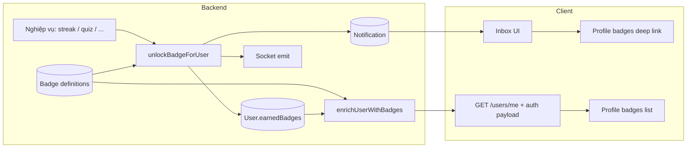

# Luồng Badge (huy hiệu / thành tựu)

Tài liệu này mô tả **end-to-end**: từ khi điều kiện đạt được → lưu badge trên user → thông báo → client hiển thị trên Profile.

---

## 1. Hai lớp dữ liệu

### Collection `Badge` (định nghĩa)

- Mỗi badge là một document: `key` (slug duy nhất), `nameVi` / `nameJa`, `emoji`, `iconImage`, `category`, `rarity`, `isActive`, …
- Admin có thể tạo/sửa qua UI admin; streak mốc có thể được seed (ví dụ `streak_7`, `streak_30`, `streak_100`).

### User — trường `earnedBadges`

- Mảng subdocument: `{ badgeKey, unlockedAt }`.
- Chỉ lưu **key đã mở** và thời điểm; metadata hiển thị (tên, emoji, ảnh) lấy từ collection `Badge` khi trả API.

---

## 2. Luồng mở khóa (tóm tắt)

```
Điều kiện nghiệp vụ đạt (ví dụ streak đủ ngày)
        │
        ▼
unlockBadgeForUser(userId, badgeKey)   ← backend/src/services/badgeUnlockService.js
        │
        ├─► Badge phải tồn tại + isActive
        ├─► User.updateOne: $push earnedBadges nếu chưa có key (idempotent)
        ├─► createNotification(..., actionType: 'open_page', actionData: { path, hash, badgeKey })
        ├─► Socket: sendNotificationToUser (realtime inbox)
        └─► Trả { unlocked, reason?, ... }
```

- **Idempotent**: gọi lại cùng `badgeKey` không tạo bản ghi trùng, không spam notification mới cho lần unlock đó.
- **Nếu không có `Badge` trong DB** cho key đó: `unlockBadgeForUser` trả `unlocked: false` (ví dụ `badge_not_found`).

---

## 3. Mốc tự động (`badgeMilestones.js`)

File: `backend/src/constants/badgeMilestones.js` — map **track + số đếm** → `Badge.key`.

| Track | Mốc (count) | Badge key |
|-------|-------------|-----------|
| `streak` | 7, 30, 100 | `streak_7`, `streak_30`, `streak_100` |
| `reading` | 1, 10 | `reading_complete_1`, `reading_complete_10` |

API unlock: `safeTryUnlockMilestoneBadge(userId, track, count)` trong `badgeUnlockService.js` (không throw, không chặn luồng chính).

### Hook đã gắn

| Sự kiện | File | Gọi |
|---------|------|-----|
| Streak check-in thành công | `streakService.js` | `safeTryUnlockMilestoneBadge(userId, 'streak', currentStreak)` |
| Bài đọc chuyển sang `done` lần đầu | `readingService.saveArticleProgress` | đếm `status=done` → `safeTryUnlockMilestoneBadge(userId, 'reading', completed)` |

### Thêm thành tựu mới (checklist)

1. **Admin** (hoặc seed): tạo `Badge` với `key` trùng mốc (ví dụ `vocab_deck_5`).
2. **`badgeMilestones.js`**: thêm track hoặc mốc, ví dụ `vocabulary: { 5: 'vocab_deck_5' }`.
3. **Service nghiệp vụ**: sau khi đạt điều kiện, gọi `safeTryUnlockMilestoneBadge(userId, 'vocabulary', count)`.
4. **Seed** (tuỳ chọn): thêm row trong `badgeSeeder.js`.

Unlock **một lần** khi `count` **khớp chính xác** một mốc (ví dụ đúng bài thứ 10 → `reading_complete_10`). Gọi lại idempotent — không spam notify.

---

## 4. Payload user cho client (Profile / auth)

- `userService.enrichUserWithBadges(userDoc)` gắn thêm `user.badges`: mảng đã join metadata từ `Badge` (nhãn vi/ja, emoji, icon, `unlockedAt`, …).
- Dùng ở: `getCurrentUser`, cập nhật profile/avatar, và response auth khi cần user đầy đủ.

---

## 5. API liên quan

| Method | Path | Mô tả |
|--------|------|--------|
| `GET` | `/api/users/me` | User hiện tại kèm `badges` (sau enrich). |
| `POST` | `/api/users/me/badges/test-unlock` | **Chỉ QA / dev** — xem mục 7 bên dưới. |

---

## 6. Frontend

- **Profile**: đọc `user.badges` (qua `buildProfileSliceFromUser` trong `mapUserProfile.js`), hiển thị danh sách; có thể có `iconUrl` nếu badge có ảnh.
- **Thông báo**: API trả `actionType` + `actionData`; `getNavigationTargetFromNotification` dựng URL kiểu `/profile?highlightBadge=<key>#badges`.
- **Header / trang Notifications**: khi user chọn một dòng, nếu có đích `open_page` thì `navigate` tới URL đó (đồng thời có thể đánh dấu đã đọc).

---

## 7. `testUnlockBadgeForCurrentUser` và production

### Hiện trạng trong code

- Controller `testUnlockBadge` (`userController.js`) kiểm tra:

  - Nếu `process.env.NODE_ENV === 'production'` → trả **403 Forbidden**, không gọi `testUnlockBadgeForCurrentUser`.

- Nghĩa là **trên production, endpoint test-unlock không làm gì cả** (không unlock, không gửi notify). Hàm `testUnlockBadgeForCurrentUser` trong `userService.js` **không bắt buộc phải xóa**: nó vẫn hữu ích cho local/staging và cho test tự động nếu sau này bạn thêm.

### Nên “bỏ đi” hay giữ?

| Cách làm | Ý nghĩa |
|----------|---------|
| **Giữ như hiện tại** | Production an toàn nhờ guard `NODE_ENV`; code QA vẫn dùng được ở dev. Phổ biến, ít rủi ro deploy nhầm. |
| **Gỡ hẳn route + service** | Giảm surface API; phải dùng cách khác (seed + thao tác thật) để QA luồng badge. |
| **Siết thêm** | Ví dụ: chỉ bật khi `NODE_ENV !== 'production'` **và** có biến env `ENABLE_BADGE_TEST_UNLOCK=true` — defense in depth. |

**Kết luận thực tế:** Không cần xóa hàm chỉ vì lên production — production đã **tắt endpoint** bằng 403. Nếu team muốn “không tồn tại route đó trên prod”, có thể sau này đăng ký route chỉ khi `NODE_ENV !== 'production'` trong file mount route (tùy chọn, không bắt buộc nếu đã 403).

### Nút trên Profile (dev)

- UI nút “QA: mở streak_7” chỉ render khi `import.meta.env.DEV` — build production của frontend **không** chứa nút đó trong bundle hành vi tương đương (Vite loại bỏ nhánh dead nếu constant false).

---

## 8. Seed / vận hành

- Chạy `npm run seed` (trong thư mục backend) để có document `Badge` cho các key mốc (streak + reading).
- Admin cũng có thể tạo badge thủ công trên Studio — **`key` phải khớp** `badgeMilestones.js`.
- Không seed → unlock streak vẫn chạy code nhưng có thể nhận `badge_not_found` cho đến khi có bản ghi `Badge` tương ứng.

---

## 9. Sơ đồ nhanh (tổng quan)



---

*Nếu sau này bạn thêm badge mới: làm theo checklist mục 3 — không cần đổi contract Profile/notification trừ khi muốn deep link khác (`actionData`).*
