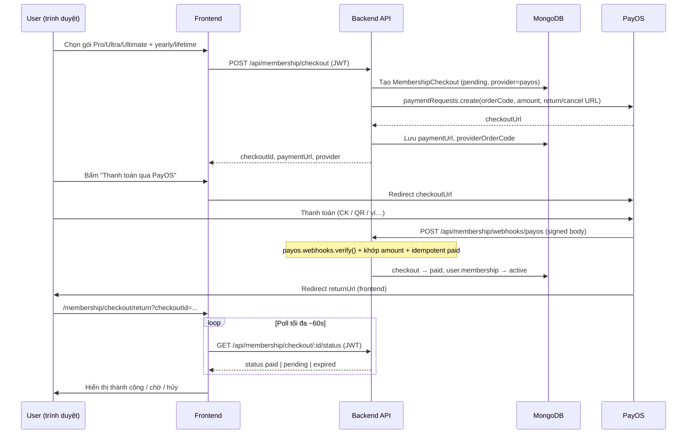

# Thanh toán membership qua PayOS (Kotonote)

Hướng dẫn **lấy API key**, cấu hình `.env`, đăng ký webhook, luồng thanh toán end-to-end và xử lý sự cố.

Tài liệu liên quan: [INSTALLATION.md](./INSTALLATION.md), [GOOGLE_OAUTH_SETUP.md](./GOOGLE_OAUTH_SETUP.md).

---

## Tổng quan

| Thành phần | Vai trò |
|------------|---------|
| **PayOS** | Cổng thanh toán VN (chuyển khoản, QR, ví liên kết…) |
| **Backend** | Tạo phiên checkout, link PayOS, nhận webhook, kích hoạt gói |
| **Frontend** | Chọn gói → redirect PayOS → trang return poll trạng thái |

Chế độ **`PAYMENT_PROVIDER=mock`**: không gọi PayOS, dùng nút “Thanh toán mô phỏng” (chỉ dev).

---

## Luồng thanh toán (sequence)



**Nguyên tắc bảo mật**

- Gói **chỉ** được kích hoạt khi webhook PayOS hợp lệ (chữ ký checksum), **không** tin query string return URL.
- `POST /checkout/:id/confirm` (mock) **tắt** khi `PAYMENT_PROVIDER=payos`.
- Số tiền webhook phải **bằng** `checkout.amountVnd`.
- Cập nhật `pending → paid` **một lần** (idempotent).

---

## Bước 1 — Đăng ký tài khoản PayOS

1. Truy cập [https://my.payos.vn](https://my.payos.vn) (hoặc [payos.vn](https://payos.vn)).
2. Đăng ký merchant / kênh thanh toán theo hướng dẫn PayOS (cá nhân hoặc doanh nghiệp).
3. Hoàn tất xác minh tài khoản và liên kết tài khoản ngân hàng nhận tiền (nếu được yêu cầu).

**Sandbox / test:** PayOS cung cấp môi trường thử — trong dashboard tìm mục **Kênh thanh toán** / **API** / **Sandbox** (tên menu có thể thay đổi theo phiên bản dashboard).

---

## Bước 2 — Lấy 3 key API (lấy ở đâu?)

Trên **my.payos.vn**:

1. Đăng nhập → chọn **Kênh thanh toán** (payment channel) bạn dùng cho website.
2. Vào mục **Thông tin tích hợp** / **API Key** / **Chi tiết kênh** (tùy giao diện).
3. Copy **3 giá trị** sau:

| Biến `.env` | Tên trên PayOS (tham khảo) | Mục đích |
|-------------|----------------------------|----------|
| `PAYOS_CLIENT_ID` | Client ID | Định danh kênh |
| `PAYOS_API_KEY` | Api Key | Gọi API tạo link thanh toán |
| `PAYOS_CHECKSUM_KEY` | Checksum Key | Ký request + **verify webhook** |

> **Lưu ý:** Không commit 3 key vào Git. Chỉ đặt trong `backend/.env` hoặc secret manager (Railway, VPS env, v.v.).

Tài liệu API chính thức: [https://payos.vn/docs/api](https://payos.vn/docs/api)  
SDK Node: [@payos/node](https://www.npmjs.com/package/@payos/node) (repo [payOSHQ/payos-lib-node](https://github.com/payOSHQ/payos-lib-node)).

---

## Bước 3 — Cấu hình `backend/.env`

```env
# Bật PayOS (production / test thật)
PAYMENT_PROVIDER=payos

# URL công khai của API — PayOS gọi webhook tới đây (bắt buộc HTTPS trên production)
API_PUBLIC_URL=https://api.ten-cua-ban.com

# URL frontend (return/cancel sau thanh toán + CORS)
CLIENT_URL=https://app.ten-cua-ban.com

PORT=5000

PAYOS_CLIENT_ID=xxxxxxxx-xxxx-xxxx-xxxx-xxxxxxxxxxxx
PAYOS_API_KEY=xxxxxxxxxxxxxxxxxxxxxxxxxxxxxxxx
PAYOS_CHECKSUM_KEY=xxxxxxxxxxxxxxxxxxxxxxxxxxxxxxxx

# Tuỳ chọn: tự đăng ký webhook mỗi lần server start
# PAYOS_AUTO_CONFIRM_WEBHOOK=true
```

| Biến | Bắt buộc (payos) | Mô tả |
|------|------------------|--------|
| `PAYMENT_PROVIDER` | Có | `payos` hoặc `mock` |
| `API_PUBLIC_URL` | **Có** (payos) | Gốc API không có `/api` cuối, ví dụ `https://api.kotonote.com` |
| `CLIENT_URL` | Có | Gốc SPA, ví dụ `https://kotonote.com` |
| `PAYOS_*` (3 key) | Có | Xem bước 2 |

**Dev local với PayOS thật:** PayOS **không** gọi được `http://localhost`. Cần tunnel:

1. Chạy `ngrok http 5000` (hoặc Cloudflare Tunnel).
2. Set `API_PUBLIC_URL=https://xxxx.ngrok-free.app` (URL HTTPS tunnel).
3. `CLIENT_URL` vẫn có thể `http://localhost:5173` nếu chỉ test FE local.

---

## Bước 4 — Đăng ký Webhook URL

PayOS cần biết URL nhận thông báo “đã thanh toán”:

```text
{API_PUBLIC_URL}/api/membership/webhooks/payos
```

Ví dụ: `https://api.kotonote.com/api/membership/webhooks/payos`

### Cách 1 — Script (khuyến nghị sau deploy / đổi domain)

Trong thư mục `backend/`:

```bash
npm run payos:confirm-webhook
```

Script gọi API PayOS `webhooks.confirm` (SDK `@payos/node`). In ra URL đã đăng ký.

- Nếu `API_PUBLIC_URL` vẫn là `localhost` → script **dừng** và nhắc dùng ngrok (trừ khi set `FORCE_PAYOS_LOCAL_WEBHOOK=true`).

### Cách 2 — Tự động khi start server

```env
PAYOS_AUTO_CONFIRM_WEBHOOK=true
```

Server log: `[payos] Webhook auto-confirmed: ...` nếu thành công.

### Cách 3 — Thủ công trên dashboard PayOS

Trong **my.payos.vn** → Kênh thanh toán → **Webhook** → dán URL ở trên (nếu PayOS cho phép sửa tay).

---

## Bước 5 — Chạy app và kiểm thử

### Mock (không cần PayOS)

```env
PAYMENT_PROVIDER=mock
```

1. Đăng nhập user → `/membership` → chọn gói trả phí.
2. Trang checkout có nút **Thanh toán thành công (mô phỏng)**.

### PayOS (sandbox hoặc production)

```env
PAYMENT_PROVIDER=payos
```

1. `API_PUBLIC_URL` trỏ tới URL **public** (ngrok hoặc server thật).
2. `npm run payos:confirm-webhook` (một lần sau khi đổi URL).
3. Khởi động backend + frontend.
4. User: `/membership` → chọn gói → **Thanh toán qua PayOS** → hoàn tất trên PayOS.
5. Kiểm tra:
   - **Lịch sử:** `/membership/history` — trạng thái `paid`.
   - **Gói hiện tại:** `/membership` — subtitle/gói đã cập nhật.
   - **Admin** (nếu có): danh sách checkout `provider: payos`.

---

## API nội bộ (tham khảo)

| Method | Path | Auth | Mô tả |
|--------|------|------|--------|
| `GET` | `/api/membership/plans` | Không | Bảng giá catalog |
| `GET` | `/api/membership/me` | JWT | Gói hiện tại |
| `POST` | `/api/membership/checkout` | JWT | Tạo phiên + link PayOS |
| `GET` | `/api/membership/checkout/:checkoutId/status` | JWT | Poll trạng thái |
| `POST` | `/api/membership/checkout/:checkoutId/confirm` | JWT | **Chỉ `mock`** |
| `GET` | `/api/membership/checkout-history` | JWT | Lịch sử giao dịch |
| `POST` | `/api/membership/webhooks/payos` | **Chữ ký PayOS** | IPN kích hoạt gói |

---

## Frontend — các route liên quan

| Route | Mô tả |
|-------|--------|
| `/membership` | Chọn / nâng cấp gói |
| `/membership/checkout?plan=pro&billing=yearly` | Tóm tắt + nút PayOS / mock |
| `/membership/checkout/return?checkoutId=...&result=return` | Xác nhận sau PayOS (poll) |
| `/membership/history` | Lịch sử thanh toán |

---

## Dữ liệu MongoDB — `MembershipCheckout`

Các field quan trọng khi tích hợp PayOS:

| Field | Ý nghĩa |
|-------|---------|
| `provider` | `mock` \| `payos` |
| `providerOrderCode` | Mã số `orderCode` gửi PayOS (unique) |
| `paymentUrl` | Link redirect PayOS |
| `providerPaymentLinkId` | ID link PayOS |
| `providerTransactionId` | Mã GD sau khi paid (từ webhook) |
| `status` | `pending` → `paid` \| `expired` \| `cancelled` |
| `amountVnd` | Số tiền — phải khớp webhook |

Gói admin tặng (`billing: free`) **không** tạo bản ghi PayOS — không xuất hiện trong lịch sử checkout.

---

## Mã lỗi app (messageCode)

| Code | Ý nghĩa |
|------|---------|
| `MSG_1103` | Đã tạo checkout |
| `MSG_1104` | Thanh toán thành công |
| `MSG_1105` | Không tìm thấy checkout |
| `MSG_1106` | Phiên checkout hết hạn |
| `MSG_1120` | PayOS chưa cấu hình (thiếu key) |
| `MSG_1121` | Webhook / chữ ký không hợp lệ |
| `MSG_1123` | Số tiền webhook ≠ đơn hàng |
| `MSG_1124` | Mock confirm bị tắt (đang dùng payos) |

---

## Checklist production

- [ ] `PAYMENT_PROVIDER=payos`
- [ ] `API_PUBLIC_URL` = HTTPS, domain cố định
- [ ] 3 key PayOS từ **kênh production** (không lẫn sandbox)
- [ ] `npm run payos:confirm-webhook` sau deploy (hoặc `PAYOS_AUTO_CONFIRM_WEBHOOK=true`)
- [ ] Firewall / reverse proxy cho phép PayOS POST tới `/api/membership/webhooks/payos`
- [ ] Không expose `PAYOS_*` ra frontend
- [ ] Test 1 giao dịch thật số tiền nhỏ → kiểm tra gói + `/membership/history`
- [ ] Test webhook trùng (PayOS retry) — gói không bị cộng hai lần

---

## Xử lý sự cố

### Đã thanh toán trên PayOS nhưng gói chưa lên

1. Webhook có tới server không? (log `[payos-webhook]`, access log nginx).
2. `API_PUBLIC_URL` lúc đăng ký webhook có đúng domain đang chạy không?
3. Chạy lại `npm run payos:confirm-webhook`.
4. Trên dashboard PayOS xem trạng thái đơn / log webhook.
5. User vào `/membership/checkout/return?checkoutId=<id>` — trang poll có thể bắt `paid` sau vài phút nếu webhook trễ.

### `npm run payos:confirm-webhook` báo localhost

Set `API_PUBLIC_URL` = URL ngrok/public, không dùng `http://localhost:5000`.

### Lỗi 401 webhook

Chữ ký sai — kiểm tra `PAYOS_CHECKSUM_KEY` đúng kênh, body JSON không bị proxy sửa.

### Nút vẫn là “mô phỏng”

`PAYMENT_PROVIDER` vẫn là `mock` hoặc thiếu key → backend fallback không tạo `paymentUrl`.

---

## File code chính

| File | Vai trò |
|------|---------|
| `backend/src/config/payment.js` | Provider, URL return/webhook |
| `backend/src/config/payosClient.js` | Khởi tạo SDK PayOS |
| `backend/src/services/payment/payosPaymentService.js` | Tạo link, verify webhook |
| `backend/src/services/payment/payosWebhookService.js` | Xử lý IPN |
| `backend/src/services/payment/fulfillCheckout.js` | Kích hoạt gói (idempotent) |
| `backend/src/scripts/payosConfirmWebhook.js` | CLI đăng ký webhook |
| `frontend/src/pages/MembershipCheckoutPage.jsx` | Redirect PayOS |
| `frontend/src/pages/MembershipCheckoutReturnPage.jsx` | Poll sau thanh toán |

---

## Tham khảo nhanh lệnh

```bash
# Backend
cd backend
cp .env.example .env
# Sửa PAYMENT_PROVIDER, PAYOS_*, API_PUBLIC_URL

npm run payos:confirm-webhook   # Sau khi có URL public
npm run dev
```

```bash
# Frontend
cd frontend
npm run dev
```

---

## Gói yearly hết hạn (cron)

- Job `membershipExpiryScheduler` chạy **mỗi giờ** (phút :10 UTC).
- User `membership.status=active`, `billing=yearly`, `expiresAt < now` → `expired`, JLPT về free.
- Chạy thủ công: `npm run membership:expire-due` (trong thư mục `backend`).

## Biên lai & hoàn tiền (admin)

- User: `GET /api/membership/checkout/:checkoutId/receipt` (chỉ checkout `paid`/`refunded` của chính user).
- Admin: `GET /api/admin/memberships/checkouts/:checkoutId/receipt`, `POST .../refund` (body: `reason?`, `revokeMembership?`).
- Hoàn tiền trong app **chỉ ghi nhận** trạng thái `refunded` + tuỳ chọn thu hồi gói; **hoàn tiền thật trên PayOS** cần xử lý trên dashboard PayOS.

---

*Cập nhật theo tích hợp PayOS trong repo Kotonote — provider `payos`, SDK `@payos/node` v2.*
